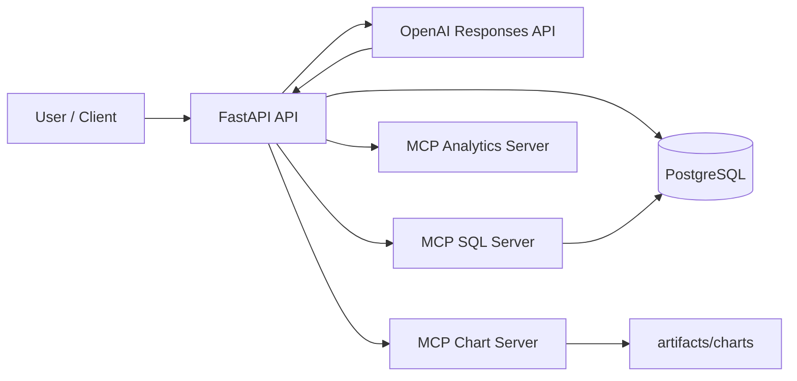

# mcp-data-analyst-agent

**Production-style AI data analyst agent using OpenAI Responses API + MCP tool servers for business analytics.**

## Why this project matters
This repository demonstrates a realistic AI platform pattern: a FastAPI orchestration layer using the OpenAI Responses API, with externalized tools exposed by MCP-style servers for SQL analytics, KPI computation, and chart generation.

## Key features
- OpenAI Responses API agent loop with iterative tool calls.
- MCP-based multi-tool architecture (SQL, analytics, chart servers).
- Read-only SQL safety guardrails.
- PostgreSQL + SQLAlchemy + Alembic data model.
- Structured analysis outputs for business reporting.
- Chart artifacts saved under `artifacts/charts/`.
- Query history persistence.
- Docker Compose local stack.
- CI with lint + tests (no real OpenAI key required).

## Architecture overview


## Project structure
```text
mcp-data-analyst-agent/
  app/
  mcp_servers/
  scripts/
  data/
  artifacts/
  tests/
  alembic/
  docs/
  .github/workflows/
```

## Prerequisites
- Docker + Docker Compose
- (Optional local dev) Python 3.12

## Environment variables
| Variable | Description | Default |
|---|---|---|
| OPENAI_API_KEY | OpenAI API key | `sk-your-key` |
| OPENAI_MODEL | Model for Responses API | `gpt-4.1-mini` |
| DATABASE_URL | SQLAlchemy DSN | `postgresql+psycopg://...` |
| MCP_SQL_SERVER_URL | SQL MCP URL | `http://mcp_sql:8101` |
| MCP_ANALYTICS_SERVER_URL | KPI MCP URL | `http://mcp_analytics:8102` |
| MCP_CHART_SERVER_URL | Chart MCP URL | `http://mcp_charts:8103` |

## Quickstart (Docker)
```bash
cp .env.example .env
make up
make migrate
curl -X POST http://localhost:8000/api/v1/demo/load-data
```

## Load sample data
```bash
curl -X POST http://localhost:8000/api/v1/demo/load-data
```

## API usage
### Ask a business question
```bash
curl -X POST http://localhost:8000/api/v1/ask \
  -H 'Content-Type: application/json' \
  -d '{"question":"What were the top 5 products by revenue last quarter?"}'
```

### Example business questions
- What were the top 5 products by revenue last quarter?
- Which region had the highest year-over-year growth?
- Show monthly revenue trend for 2025 and highlight anomalies.
- Summarize customer churn by segment and explain drivers.
- Compare Q4 revenue versus Q3 and identify underperforming categories.

### Example response JSON
```json
{
  "question": "What were the top 5 products by revenue last quarter?",
  "executive_summary": "Q4 revenue concentrated in Electronics and Home.",
  "key_findings": ["Product P002 led revenue", "APAC grew 14.2% QoQ"],
  "methodology": ["Called sql.run_sql_readonly", "Called analytics.compare_periods", "Called charts.create_bar_chart"],
  "assumptions": ["Quarter boundaries use calendar quarters"],
  "sources": [{"type": "table", "name": "sales"}, {"type": "tool", "name": "compare_periods"}],
  "charts": [{"chart_id": "abc123", "title": "Top Products", "path": "artifacts/charts/abc123.png"}],
  "warnings": [],
  "model": "gpt-4.1-mini",
  "tool_calls": [{"server": "sql", "tool": "run_sql_readonly", "status": "success"}],
  "request_id": "resp_..."
}
```

### Tool flow example
1. `sql.list_tables` and `sql.describe_table` to discover schema.
2. `sql.run_sql_readonly` to aggregate sales.
3. `analytics.compare_periods` for quarter deltas.
4. `charts.create_bar_chart` for visual artifact.

### Chart artifact
Charts are generated by MCP chart server and saved to `artifacts/charts/<chart_id>.png`, then served by:
```bash
curl http://localhost:8000/api/v1/charts/<chart_id> --output chart.png
```

## Testing
```bash
make test
```

## Linting
```bash
make lint
make format
```

## Troubleshooting
- **DB not ready**: wait for `postgres` healthcheck, then rerun `make migrate`.
- **OpenAI errors**: verify `OPENAI_API_KEY` and network connectivity.
- **No charts**: ensure `artifacts/` is writable and mounted.

## Design decisions and trade-offs
- Chose direct OpenAI SDK + custom orchestration for clarity over heavy frameworks.
- MCP servers exposed as HTTP microservices for explicit tool boundaries.
- SQL server uses strict read-only validation and hard row limits.

## Limitations
- Tool parameter schema is intentionally broad to keep orchestration simple.
- No auth layer (demo/portfolio focus).
- Advanced cost accounting is minimal.

## Roadmap
- Add strict JSON schema enforcement in model output.
- Add richer chart style options and report generation.
- Add optional semantic cache for repeated questions.

## Security note
- SQL tool rejects mutating/destructive statements.
- Secrets loaded via env vars only.
- Chart files are generated in controlled artifact directories.

## License
MIT
